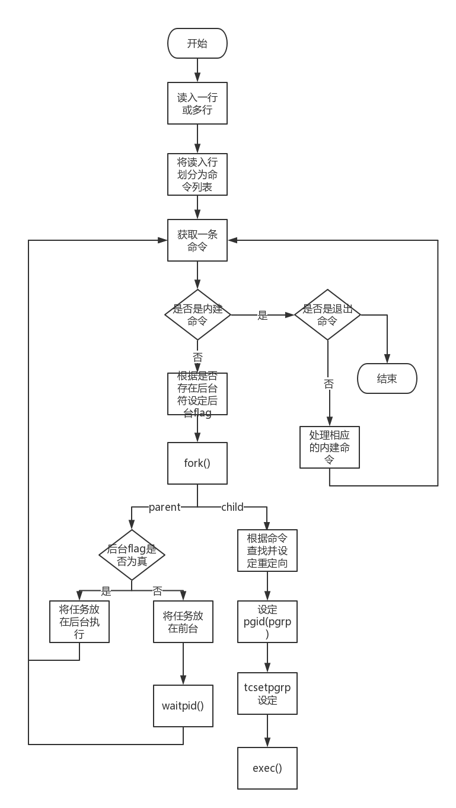

# ezsh详细设计文档

> 编写人：VivianSnow
>
> 编写日期: 2017年5月4日
>
> 第二次更新日期: 2017年5月22日
>
> 第三次更新日期: 2017年6月7日

## 流程图及总体设计



## 功能模块设计

### readline_and_history模块

#### 模块描述

本模块主要用于从终端中读入以及历史的处理，主要用到了GNU lreadline库

#### 模块宏定义描述

无

#### 自定义数据结构描述

无

#### 模块接口

函数原型

```c
char *read_cmd_line();
```

函数描述

​	从终端中读入一行或多行，返回读入到的内容

函数原型

```c
char** get_cmd(char *cmd_line);
```

函数描述

​	传入一个字符串，返回一个char**表示用`;`隔开的各个命令

函数原型

```c
void init_history();
```

函数描述

​	初始化lreadline库中自带history功能。

函数原型

```c
void history_command();
```

函数描述

​	history命令实现

函数原型

```c
char* history_repeat(char *cmd);
```

函数描述

​	`Event Designators`功能的实现

-----

### job模块

#### 模块描述

job模块主要负责shell中作业控制功能的实现

#### 模块宏定义描述

宏定义

```c
#define MAXLINE (1024)
#define MAX_JOB (256)

#define JOB_RUNNING (0)
#define JOB_STOPED (1)
#define JOB_DONE (2)
```

宏定义描述

​	`MAXLINE`表示一条command的最大长度

​	`MAX_JOB`表示最多的作业数量

​	`JOB_RUNNING`, `JOB_STOPED`和`JOB_DONE`三个宏用来标记一个作业现在的状态

#### 自定义数据结构描述

自定义数据结构定义

```c
struct job {
    //In order to avoid problem cause by convert from unsigned to singed, we use int type
    int job_no; /* command no, used for messages */
    char job_cmd[MAXLINE]; /* command line, used for messages */
    unsigned int job_stat; /*job status, RUNING,STOPED or DONE */
    pid_t job_pgid;         /* process group ID */
    struct termios job_tmodes;      /* saved terminal modes */
};
```

自定义数据结构描述

​	结构体job用来保存一个作业的相关信息，`job_no`表示作业的编号，`job_cmd`表示作业的命令，`job_stat`用来标记当前作业的状态，`job_pgid`用来保存作业的process group ID，`job_tmodes`用来保存当前作业的terminal modes

自定义数据结构定义

```c
struct jobs{
    int jobs_next_no;
    int jobs_alive_no;
    struct job jobs_list[MAX_JOB*4];
};
```

自定义数据结构描述

​	结构体jobs用来shell中所有作业的相关信息，`job_next_no`表示下一个作业的编号，`jobs_alive_no`表示当前shell中活跃的作业数量，成员`jobs_list`是一个结构体job的数组，用来保存每一个作业的信息。

#### 模块接口

函数原型

```c
int jobs_init();
```

函数描述

​	作业相关初始化。

函数原型

```c
int add_jobs(pid_t pid, const char *cmd);
```

函数描述

​	根据传入的pid和cmd，在jobs中更新并创建一个作业

函数原型

```c
int add_jobs(pid_t pid, const char *cmd);
```

函数描述

​	根据传入的pid和cmd，在jobs中更新并创建一个作业

函数原型

```c
void refresh_all_job_status();
```

函数描述

​	更新所有作业的状态。

函数原型

```c
void jobs_command();
```

函数描述

​	jobs内置命令的实现

函数原型

```c
int bg_command(const char* cmd);
```

函数描述

​	bg命令的实现

函数原型

```c
int fg_command(const char* cmd);
```

函数描述

​	fg命令的实现

函数原型

```c
void put_job_in_foreground(int no);
```

函数描述

​	将作业编号为no的作业转入前台执行

函数原型

```c
void put_job_in_background (int no);
```

函数描述

​	将作业编号为no的作业在后台继续执行

------

### export模块

#### 模块描述

本模块主要实现export命令和shell prompt的相关处理。

#### 模块宏定义描述

无

#### 自定义数据结构描述

无

#### 模块接口

函数原型

```c
int export_command(const char *cmd);
```

函数描述

​	export内置命令的实现

-----

### utils模块

#### 模块描述

对于程序中一些公用的工具函数，将其存放在utils模块下

####模块宏定义描述

宏定义

```c
#define ISSPACE(x) ((x)==' '||(x)=='\r'||(x)=='\n'||(x)=='\f'||(x)=='\b'||(x)=='\t')
```

宏定义描述

​	判断x是否为空字符

####自定义数据结构描述

无

#### 模块接口

函数原型

```c
int trim(char *string);
```

函数描述

​	删去string前后的空字符

------

### redirect模块

#### 模块描述

redirect模块主要负责shell中输入命令重定向功能的实现

#### 模块宏定义描述

宏定义

```c
#define O_MY_ACCMODE (S_IRUSR | S_IWUSR | S_IRGRP | S_IROTH)
#define O_NORMALFLAG (O_WRONLY | O_CREAT | O_TRUNC)
#define O_APPENDFALG (O_WRONLY | O_CREAT | O_APPEND)
```

宏定义描述

​	`O_MY_ACCMODE`表示默认的创建文件赋予的权限

​	`O_NORMALFLAG`表示重定向时所用的open选项

​	`O_APPENDFALG`表示追加重定向时所用的open选项

#### 自定义数据结构描述

自定义数据结构定义

```c
struct redirect_path {
    char redirect_input_path[PATH_MAX];
    char redirect_output_path[PATH_MAX];
    char redirect_error_path[PATH_MAX];

    /*bit fields should more efficient and readable than mask and bitwise*/
    unsigned int redirect_input_append : 1;
    unsigned int redirect_output_append : 1;
    unsigned int redirect_error_append : 1;

};
```

自定义数据结构描述

​	redirect_path结构体用于保存重定向路径名及是否追加选项等，如果`redirect_input_path`, `redirect_output_path`和`redirect_error_path`不为空，则表示有重定向，否则表示没有重定向

#### 模块接口

函数原型

```c
int find_redirect_symbol(char *buf, struct redirect_path *redirect_path_ptr);
```

函数描述

​	找到传入的buf中的重定向，并将路径和追加重定向flag存入redirect_path_ptr中

函数原型

```c
void redirect(struct redirect_path *redirect_path_ptr);
```

函数描述

​	根据redirect_path_ptr中的选项进行对当前的进程进行重定向

### 信号处理模块

#### 模块描述

本模块主要用于处理各作业和shell中信号相关的处理

#### 模块宏定义描述

无

#### 自定义数据结构描述

无

#### 模块接口

函数原型

```c
void shell_signal_init();
```

函数描述

​	shell信号初始化。

函数原型

```c
void job_signal_init();
```

函数描述

​	作业信号初始化